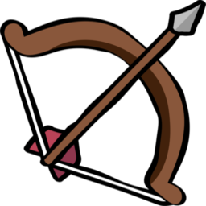

<div align="center">



# Game of The Amazons


**A strategic board game implementation featuring AI opponents with multiple difficulty levels, built with C++ and the natID framework.**

**Academic Project** • Artificial Intelligence • Data Science and AI • ETF Sarajevo


</div>

## 📋 Table of Contents

- [Overview](#-overview)
- [Features](#-features)
- [Demo](#-demo)
- [Technologies](#%EF%B8%8F-technologies)
- [Prerequisites](#-prerequisites)
- [Installation](#-installation)
- [Building the Project](#-building-the-project)
- [Usage](#-usage)
- [Game Rules](#-game-rules)
- [AI Implementation](#-ai-implementation)
- [Architecture](#%EF%B8%8F-architecture)
- [Project Structure](#project-structure)
- [Screenshots](#-screenshots)
- [Team](#-team)
- [Contributing](#-contributing)
- [License](#-license)
- [Contact](#-contact)

---

## 🎯 Overview

Game of the Amazons is a **sophisticated strategy board game** where players control four queens each on a variable-sized grid. Built as part of the **Artificial Intelligence** course at the Faculty of Electrical Engineering (ETF), University of Sarajevo, it demonstrates practical applications of **game theory**, **graph algorithms**, and **AI decision-making** in a real-world interactive application.

The game combines elements of **chess** and **territorial control**, challenging players to outmaneuver their opponent while strategically blocking their movement options. This implementation features an **intelligent AI opponent** powered by the **Minimax algorithm with alpha-beta pruning**, capable of playing at multiple difficulty levels.

**Academic Context:**

- **Course:** DSAI - Artificial Intelligence
- **Professor:** Prof. Dr. Izudin Džafic
- **Academic Year:** 2025/26

---

## ✨ Features

### Core Gameplay

- 🎯 **Multiple Game Modes** - Player vs Player, Player vs AI, AI vs AI
- 🤖 **Intelligent AI** - Minimax with alpha-beta pruning (3 difficulty levels)
- 📐 **Board Size Options** - 6×6 (Small), 8×8 (Medium), 10×10 (Large)
- ✅ **Legal Move Validation** - Real-time highlighting of valid moves
- ⚡ **Optimized Performance** - Fast move generation with ray-casting algorithm
- 🎲 **Strategic Depth** - High branching factor with complex decision trees

### Visual Experience

- 🎨 **8 Board Themes** - Wooden, Black & White, Diamond, Ice, Stone, Tournament, Bubblegum, Custom
- 🎬 **Smooth Animations** - Queen movement, arrow shooting, field explosions
- 💎 **Custom Theme Builder** - Create your own board colors with color pickers
- 🎭 **Victory/Defeat Overlays** - Visual feedback for game endings
- 📱 **Responsive Layout** - Adaptive UI with navigation sidebar

### Audio & Localization

- 🔊 **Sound Effects** - Movement sounds, arrow flight, explosions, victory/defeat
- 🌍 **6 Languages** - English, Bosnian, German, Spanish, French, Japanese

### User Features

- 📊 **Move History** - Complete game log with detailed move tracking
- ↩️ **Undo Function** - Take back moves (disabled during AI thinking)
- ⚙️ **Settings Dialog** - Comprehensive configuration options
- 📖 **Interactive Rules** - In-game tutorial and strategy tips
- 🎚️ **Animation Speed** - Adjustable slider for preferred pacing

## 🎥 Demo

### Quick Tour

1. 🎮 Launch the application and select game mode
2. ⚙️ Configure board size, difficulty, and theme
3. 🎯 Make strategic moves with queen and arrow placement
4. 📊 Review move history in the Logs tab

### Key Features in Action

- **Smart AI**: Watch the computer evaluate thousands of positions per move
- **Visual Feedback**: Highlighted valid moves show available options
- **Theme Customization**: Switch themes on-the-fly without restarting
- **Move Analysis**: Review complete game history with formatted notation

## 🛠️ Technologies

### Core Technologies

- **C++ 17** - Modern C++ with STL containers and algorithms
- **natID Framework** - Cross-platform GUI toolkit
- **CMake 3.18+** - Build system and project configuration
- **Ninja / Make** - Fast incremental builds

### Algorithms & Data Structures

- **Minimax Algorithm** - AI decision-making with game tree search
- **Alpha-Beta Pruning** - Search space optimization (50-70% reduction)
- **Ray-Casting** - Line-of-sight movement validation

## 🔧 Prerequisites

Before installing, ensure you have the following:

- **Operating System:** Windows 10/11 (primary), macOS, or Linux
- **CMake:** Version 3.18 or higher
- **C++ Compiler:**
  - Windows: MSVC 2019 or newer / MinGW-w64
  - macOS: Xcode Command Line Tools
  - Linux: GCC 9+ or Clang 10+
- **natID Framework:** Must be installed in `$HOME/`
- **Build Tool:** Ninja (recommended) or Make

## 📥 Installation

### 1. Install natID Framework

Follow the natID installation instructions from its repository:
[https://github.com/idzafic/natID.git](https://github.com/idzafic/natID.git)

### 2. Clone the Repository

```bash
git clone https://github.com/ehadziabdic/GameOfTheAmazons.git
```

Move it into the `$HOME/Work/CPProjects` directory.

### 3. Create Build Directory

```bash
mkdir build
cd build
```

## 🔨 Building the Project

### Windows (MSVC)

```bash
cmake -G "Ninja" -DCMAKE_BUILD_TYPE=Release ..
cmake --build .
```

### macOS/Linux

```bash
cmake -DCMAKE_BUILD_TYPE=Release ..
make -j$(nproc)
```

### Build Output

After successful compilation, the executable will be located in:

- Windows: `build/AmazonsGame.exe`
- macOS: `build/AmazonsGame.app`
- Linux: `build/AmazonsGame`

## 🚀 Usage

### Running the Application

After building, launch the executable:

```bash
# Windows
.\build\AmazonsGame.exe

# macOS
open build/AmazonsGame.app

# Linux
./build/AmazonsGame
```

### Starting a New Game

1. **Select Player Types**
   - Use dropdown menus to choose Human or AI for White/Black players
   - Options: Human, AI

2. **Configure Settings** (click Settings button)
   - **Board Size**: 6×6, 8×8, or 10×10
   - **AI Difficulty**: Easy (1-2 depth), Medium (3-4 depth), Hard (5+ depth)
   - **Board Theme**: Choose from 8 visual styles
   - **Language**: Select from 6 available languages
   - **Custom Colors**: Enable custom theme and pick your own tile colors

3. **Adjust Animation Speed**
   - Use slider to control movement and effect speeds
   - Faster speeds for experienced players, slower for learning

4. **Start Playing**
   - Click "New Game" button to begin
   - White player moves first

### Making a Move

Each turn consists of **two sequential phases**:

1. **Queen Movement Phase**
   - Click one of your queens (highlighted when selectable)
   - Valid destination squares are highlighted
   - Click desired square to move queen
   - Queens move like chess queens (any distance orthogonal or diagonal)
   - Cannot jump over pieces or blocked squares

2. **Arrow Placement Phase**
   - After queen lands, arrow placement mode activates
   - Valid arrow targets are highlighted from queen's new position
   - Click square to shoot arrow
   - Arrow travels like a queen move
   - Square becomes permanently blocked for remainder of game

### Game Controls

- **New Game Button**: Start fresh game with current settings
- **Undo Button**: Take back last move (disabled during AI thinking)
- **Settings Button**: Open configuration dialog
- **Animation Slider**: Adjust speed on-the-fly
- **Navigator Tabs**: Switch between Game, Logs, Rules views

### Viewing Game Information

- **Logs Tab**: View complete move history
  - Format: "Move N: Queen (r,c) → (r,c), Arrow → (r,c)"
  - Chronological list of all moves played
  
- **Rules Tab**: Access comprehensive game rules and strategy tips
  - Game objective and mechanics
  - Feature descriptions
  - Strategic advice

### Winning the Game

- Game ends when a player **cannot make a legal move**
- The **last player able to move wins**
- Victory/defeat overlay displays for 4 seconds with sound effect
- View winner announcement and start new game

## 📜 Game Rules

### Basic Rules

- **Board Setup:** Each player starts with 4 queens
  - Player 1 (White): Bottom side
  - Player 2 (Black): Top side
- **Turn Structure:** Move one queen, then shoot one arrow
- **Movement:** Queens move any distance in 8 directions (like chess queens)
- **Restrictions:** Cannot jump over pieces or arrows
- **Win Condition:** Opponent has no legal moves

### Strategy Tips

- **Mobility is Key:** More legal moves = stronger position
- **Control Territory:** Try to claim more accessible board space
- **Block Opponent:** Use arrows to limit opponent's movement options
- **Plan Ahead:** Consider both your move and arrow placement carefully

## 🤖 AI Implementation

### Algorithms

#### Core Game Logic

- **Line-of-Sight Ray Casting:** Efficient move generation by scanning 8 directions until hitting obstacles
- **Move Validation:** Two-phase validation (queen path + arrow path)

#### Heuristic Evaluation

The AI evaluates board positions using:

- **Mobility Analysis:** Count of legal moves
  - Counts all legal moves for current player
  - Counts all legal moves for opponent
  - Position score = MyMoves - OpponentMoves
  - Higher mobility = stronger position

#### Search Algorithm

- **Minimax with Alpha-Beta Pruning**
  - Easy: Depth 1-2
  - Medium: Depth 3-4
  - Hard: Depth 5+
- **Optimizations:** Pruning reduces search space by ~50-70%

## 🏗️ Architecture

### Core Components

- **Board/Grid:** Manages game state, queen/arrow positions
- **Game State:** Tracks turn order, move history, valid moves
- **Move Generator:** Calculates legal moves using ray-casting
- **Win Checker:** Detects game-ending conditions
- **AI Engine:** Minimax algorithm with heuristic evaluation

### GUI Components

- **Board Canvas:** Renders grid, pieces, animations, overlays
- **Main View:** Game controls, settings, navigation
- **Logs View:** Move history display
- **Rules View:** Interactive game rules and help

### Project Structure

```txt
Project/
├── src/                          # Source code
│   ├── main.cpp                 # Application entry point
│   ├── MainWindow.h             # Main window with toolbar and menu
│   ├── MainView.h               # Game view with controls and navigation
│   ├── AmazonsBoardCanvas.h     # Board rendering and interaction
│   ├── Board.h                  # Board data structure and tile management
│   ├── GameState.h              # Game state tracking and move history
│   ├── Algorithms.h             # AI algorithms (Minimax, evaluation)
│   ├── Rules.h                  # Move generation and validation
│   ├── RulesView.h              # Rules page UI component
│   ├── LogsView.h               # Move history page UI component
│   ├── ToolBarMain.h            # Toolbar with game controls
│   ├── SettingsPopup.h          # Settings dialog implementation
│   └── DialogSettings.h         # Settings dialog wrapper
├── res/                          # Resources
│   ├── main.xml                 # Resource registration (images, sounds)
│   ├── DevRes.xml               # Development resources
│   ├── images/                  # Graphics assets
│   │   ├── victory.png          # Victory overlay image
│   │   ├── defeat.png           # Defeat overlay image
│   │   └── (board themes)       # Theme textures
│   ├── sounds/                  # Audio files
│   │   ├── victory.wav          # Victory sound
│   │   ├── defeat.wav           # Defeat sound
│   │   ├── arrow.wav            # Arrow flight sound
│   │   └── blaze.wav            # Explosion sound
│   ├── tr/                      # Translations
│   │   ├── main_EN.xml          # English
│   │   ├── main_BA.xml          # Bosnian
│   │   ├── main_DE.xml          # German
│   │   ├── main_ES.xml          # Spanish
│   │   ├── main_FR.xml          # French
│   │   └── main_JP.xml          # Japanese
│   └── appIcon/                 # Application icons
│       ├── winAppIcon.cpp       # Windows icon resource
│       └── AppIcon.plist        # macOS icon config
├── build/                        # Build output (generated)
│   ├── AmazonsGame.exe          # Windows executable
│   ├── AmazonsGame.app          # macOS application bundle
│   ├── AmazonsGame              # Linux executable
│   └── (build files)            # CMake cache, object files, etc.
├── docs/                         # Documentation
│   └── readme-test.md           # README example/reference
├── CMakeLists.txt               # CMake build configuration
├── AmazonsGame.cmake            # Project-specific CMake settings
├── LICENSE                      # MIT License
└── README.md                    # This file
```

## 📸 Screenshots

### Main Game View


*Game board with highlighted valid moves and control panel*

### Board Themes


*Examples of different visual themes (Wooden, Diamond, Ice, Stone)*

### Settings Dialog


*Configuration options for board size, difficulty, theme, and language*

### Move History


*Logs tab showing complete game notation*

### Rules View


*In-game tutorial and strategy guide*

---

## 👥 Team

### Project Team

- **Emin Hadžiabdić**
  - GUI Development (natID framework)
  - Visual design and user interaction
  - Animation and sound integration

- **Armin Memišević**
  - Game engine architecture
  - Minimax algorithm implementation
  - System integration

- **Muhammed Pašić**
  - Core game logic and rules
  - Move validation and board management
  - Game state coordination

## 👥 Contributing

Contributions are welcome! Please follow these steps:

1. Fork the repository
2. Create feature branch (`git checkout -b feature/AmazingFeature`)
3. Commit changes (`git commit -m 'Add AmazingFeature'`)
4. Push to branch (`git push origin feature/AmazingFeature`)
5. Open Pull Request

### Development Guidelines

- Follow existing code style and naming conventions
- Add comments for complex algorithms
- Test on multiple platforms when possible
- Update documentation for new features

## 📄 License

This project is licensed under the MIT License - see the [LICENSE](LICENSE) file for details.

## 📧 Contact

-> **Project Team**

- Emin Hadžiabdić - [@ehadziabdic](https://github.com/ehadziabdic)
  
- Armin Memišević - [@arminn2206](https://github.com/arminn2206)
  
- Muhammed Pašić - [@MuhaxD](https://github.com/MuhaxD)

-> **Institution**  
Data Science and Artificial Intelligence  
Faculty of Electrical Engineering (ETF)  
University of Sarajevo

-> **Project Link:** [https://github.com/ehadziabdic/GameOfTheAmazons](https://github.com/ehadziabdic/GameOfTheAmazons)

---

⭐ Star this repo if you found it helpful!
